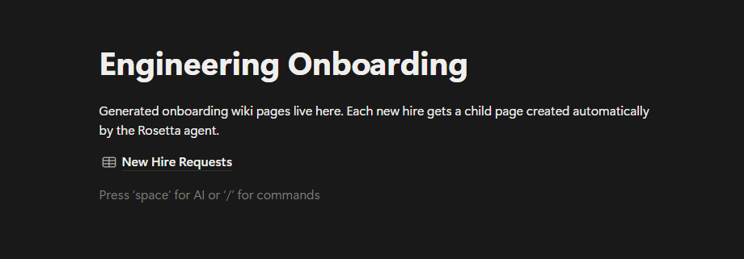
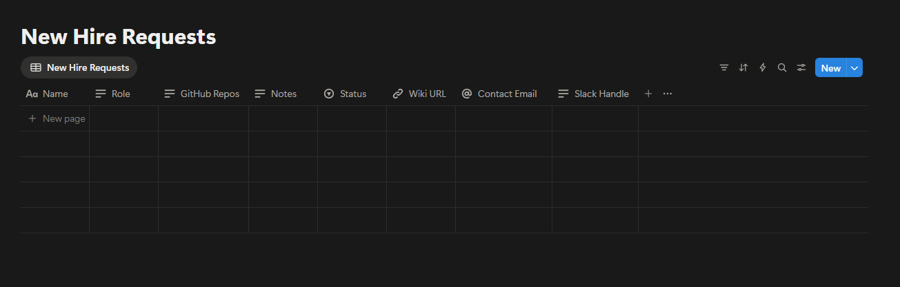
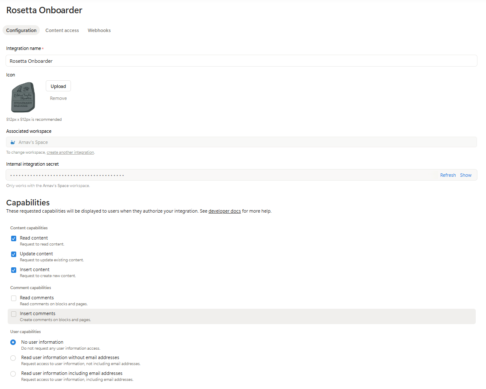
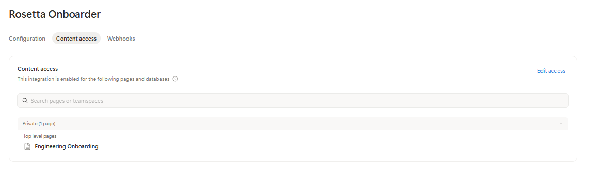
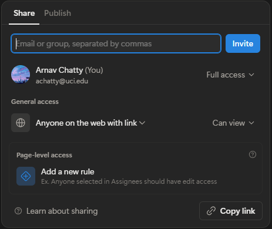

# Usage Guide

Setup, configuration, and day-to-day usage for Rosetta Onboarder.

---

## Prerequisites

- Python 3.13+
- Node.js (for `notion-mcp-server`)
- [ngrok](https://ngrok.com/download) (optional — only needed for Notion webhook auto-trigger)
- A Notion account and a Slack workspace

---

## Installation

```bash
pip install -e .
npm install -g notion-mcp-server
```

---

## Configuration

Run `rosetta setup` for an interactive wizard that configures everything below.

**`.env`** (project root)
```
ANTHROPIC_API_KEY=sk-ant-...
NOTION_TOKEN=ntn_...
NOTION_ONBOARDING_PAGE_ID=...
NOTION_DATABASE_ID=...
GITHUB_TOKEN=github_pat_...
GEMINI_API_KEY=AIza...
SLACK_BOT_TOKEN=xoxb-...
SLACK_APP_TOKEN=xapp-...
NOTION_WEBHOOK_SECRET=<auto-written by rosetta serve during webhook verification>
CLAUDE_MODEL=claude-haiku-4-5-20251001
GITHUB_MAX_ISSUES=3
GITHUB_MAX_PRS=2
GITHUB_TREE_DEPTH=1
```

### Environment variable reference

| Variable | Required | Description |
|---|---|---|
| `ANTHROPIC_API_KEY` | Yes | Anthropic API key |
| `NOTION_TOKEN` | Yes | Notion internal integration token (`ntn_...`) |
| `NOTION_ONBOARDING_PAGE_ID` | Yes | Page ID of the top-level onboarding hub page |
| `NOTION_DATABASE_ID` | Yes | Page ID of the New Hire Requests database |
| `GITHUB_TOKEN` | Recommended | GitHub PAT — needed for private repos, raises rate limit from 60 to 5000 req/hr |
| `GEMINI_API_KEY` | Yes (for Slack chat) | Google AI Studio key — powers RAG for the Slack bot |
| `SLACK_BOT_TOKEN` | Yes (for Slack) | Slack bot OAuth token (`xoxb-...`) |
| `SLACK_APP_TOKEN` | Yes (for Slack chat) | Slack app-level token (`xapp-...`) with `connections:write` — enables Socket Mode |
| `NOTION_WEBHOOK_SECRET` | No | Verification token from webhook setup — enables instant auto-trigger. Written automatically by `rosetta serve` when Notion sends the verification request. |
| `CLAUDE_MODEL` | No | Claude model to use (default: `claude-haiku-4-5-20251001`) |
| `GITHUB_MAX_ISSUES` | No | Max issues to fetch per repo (default: `3`) |
| `GITHUB_MAX_PRS` | No | Max PRs to fetch per repo (default: `2`) |
| `GITHUB_TREE_DEPTH` | No | Directory tree depth (default: `1`) |

---

## Notion workspace setup (one-time)

**1. Create the pages**

Duplicate the [public page link](https://www.notion.so/Engineering-Onboarding-32ef78cab142810d8353ca62c3a9e6ae?source=copy_link). End goal is for this to be a publicly available template on the Marketplace.

Alternatively, run `rosetta setup` — it will create the New Hire Requests database and Wiki Archive page inside a page you create and share with your integration.

Or manually create a top-level page and inside it a database called **New Hire Requests** with the following schema:

| Property | Type | Purpose |
|---|---|---|
| Name | title | New hire's full name |
| Role | rich_text | e.g. "Backend Engineer" |
| GitHub Repos | rich_text | One GitHub URL per line |
| Notes | rich_text | Additional context for the agent |
| Status | select | `Pending` → `Ready` → `Processing` → `Done` |
| Wiki URL | url | Written back by agent after generation |
| Contact Email | email | Optional |
| Slack Handle | rich_text | Optional |


---


**2. Grant the integration content access**

Go to [notion.so/profile/integrations](https://notion.so/profile/integrations) → your integration → **Content access** tab. Add the onboarding hub page. The database inside it is automatically included.





**3. Set the page to public**

On the onboarding hub page: **Share → Share to web → Anyone with the link can view**.

Child wiki pages inherit this setting — do it once and all generated wikis will be publicly accessible without a Notion account.



**4. Copy the page IDs**

The page ID is the UUID at the end of the Notion URL. Set `NOTION_ONBOARDING_PAGE_ID` and `NOTION_DATABASE_ID` in your `.env` (or run `rosetta setup`).

---

## Slack app setup (one-time)

The Slack bot sends DM notifications and answers new hire questions via Socket Mode — no public URL required.

**1. Create a Slack app**

Go to [api.slack.com/apps](https://api.slack.com/apps) → **Create New App** → **From scratch**. Name it (e.g. "Rosetta Onboarder") and select your workspace.

**2. Add bot token scopes**

In the app settings: **OAuth & Permissions** → **Bot Token Scopes**. Add:

| Scope | Purpose |
|---|---|
| `chat:write` | Send DMs |
| `users:read` | Resolve Slack handles to user IDs |
| `im:write` | Open DM channels |
| `im:read` | Read DM metadata |
| `im:history` | Read DM history (required for Socket Mode message events) |

**3. Install to workspace**

**OAuth & Permissions** → **Install to Workspace**. Copy the **Bot User OAuth Token** (`xoxb-...`) into `SLACK_BOT_TOKEN`.

**4. Enable Socket Mode**

**Settings** → **Socket Mode** → toggle on. Then **Basic Information** → **App-Level Tokens** → **Generate Token and Scopes**. Name it (e.g. `rosetta-socket`), add the `connections:write` scope, generate, and copy the token (`xapp-...`) into `SLACK_APP_TOKEN`.

**5. Enable Event Subscriptions**

**Event Subscriptions** → toggle on → **Subscribe to bot events** → add `message.im`. Save changes.

---

## Webhook setup (optional — enables instant auto-trigger)

Without a webhook, `rosetta serve` polls the New Hire Requests database every 5 minutes for rows with `Status = Ready`. The webhook makes it instant. Both require `rosetta serve` to be running.

**1. Start a public tunnel**

```bash
ngrok http 8000
```

Copy the `https://` Forwarding URL. Run `rosetta setup` (webhook step) or set `WEBHOOK_PUBLIC_URL` in `.env` directly.

**Note:** ngrok free tier assigns a new URL each session. When you restart ngrok, update `WEBHOOK_PUBLIC_URL` in `.env` and the webhook URL in the Notion dashboard, then restart `rosetta serve`.

**2. Register the webhook in Notion**

Go to [notion.so/profile/integrations](https://notion.so/profile/integrations) → your integration → **Webhooks** → **Add webhook**.

- URL: `{WEBHOOK_PUBLIC_URL}/webhook/notion`
- Event: `page.properties_updated` only

Click **Create subscription** — Notion immediately POSTs a verification token to the endpoint.

**3. Capture the verification token**

Copy the token from the `rosetta serve` terminal logs (look for `NOTION WEBHOOK VERIFICATION TOKEN: ...`). Paste it into the Notion verification form and submit. Set `NOTION_WEBHOOK_SECRET=<that token>` in `.env` and restart `rosetta serve`.

The verification token is also the HMAC-SHA256 signing key used to authenticate all future webhook payloads.

---

## Running

**Standard session:**

```bash
rosetta serve
```

`rosetta serve` starts in one process: the uvicorn HTTP server (webhook listener), and the Slack Socket Mode bot (if `SLACK_APP_TOKEN` is set). The Slack bot connects outbound to Slack — no public URL needed for it.

**With webhook auto-trigger (optional):**

```bash
# Terminal 1 — public tunnel for the Notion webhook endpoint
ngrok http 8000
# Update WEBHOOK_PUBLIC_URL in .env with the new ngrok URL

# Terminal 2
rosetta serve
```

**Adding a new hire:**

```bash
rosetta onboard
```

Prompts for name, role, GitHub repos, and contact details, then creates a `Ready` row in the database. `rosetta serve` picks it up automatically (instantly via webhook, or within 5 minutes via polling).

**Manual trigger (re-processing or debugging):**

```bash
rosetta onboard <notion-page-id>
```

The page ID is the UUID at the end of the DB row's Notion URL.

---

## Slack chat

After wiki generation, the new hire receives a Slack DM with their wiki link and an invitation to ask questions. They reply directly in that DM thread — no browser, no Notion account required.

- `rosetta serve` must be running with `SLACK_APP_TOKEN` set for the bot to respond
- The bot answers using RAG over the generated wiki and README content (top-3 chunks, Gemini embeddings)
- If `GEMINI_API_KEY` is not set, embeddings are skipped and the bot will not have wiki context
- The `Slack Handle` field on the DB row must be filled in (with or without the leading `@`) to send the DM
